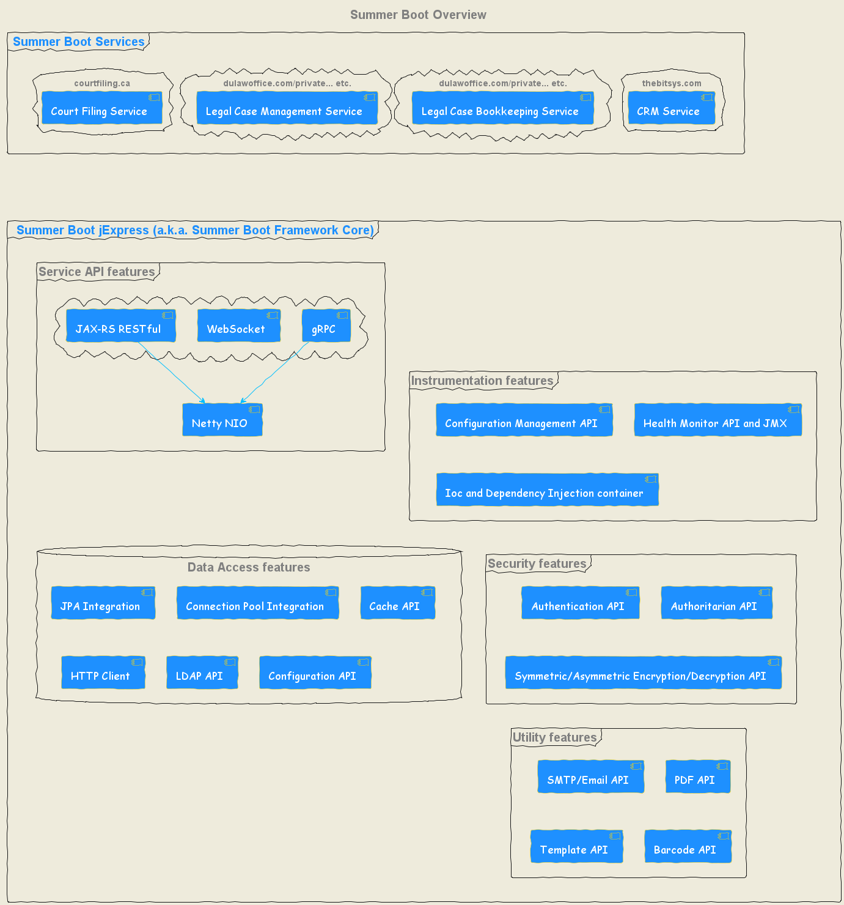

# Summer Boot Framework — jExpress

[View Changelog (CHANGES)](CHANGES.md)

> **Java 21+ · Netty 4.2 · Guice 7 · Jakarta EE · Virtual Threads**

Summer Boot Framework was initiated by a group of developers in 2004 to provide a high-performance, free, customizable, and lightweight Netty JAX-RS RESTful, WebSocket, and gRPC
service with JPA and other powerful reusable non-functional features. Since 2011, it has been adopted by several Toronto law firms to customize their back-end services.

Its sub-project, **jExpress** (a.k.a. Summer Boot Framework Core), focuses on solving the following non-functional and operational maintainability requirements.



**Open Source History:** jExpress was initially open-sourced on MS MySpace in Sep 2006. Due to the shutdown of MySpace, this framework was migrated to a server sponsored by one of
the law firms in October 2011, then to GitLab in Dec 2016, and eventually to GitHub in Sep 2021.

> Disclaimer: We really had a great time with GitLab until 2021 when we realized one of the contributor's employers was also using GitLab at that time. We decided to move to GitHub
> instead to avoid incurring unnecessary hassles.

---

## Maven Dependency

```xml

<dependency>
    <groupId>org.summerboot</groupId>
    <artifactId>jexpress</artifactId>
    <version>2.6.6</version>
</dependency>
```

SNAPSHOT repository:

```xml

<repositories>
    <repository>
        <id>maven.snapshots</id>
        <name>Maven Snapshot Repository</name>
        <url>https://s01.oss.sonatype.org/content/repositories/snapshots/</url>
        <releases>
            <enabled>false</enabled>
        </releases>
        <snapshots>
            <enabled>true</enabled>
        </snapshots>
    </repository>
</repositories>
```

- **Apache Central:** https://repo.maven.apache.org/maven2/org/summerboot/jexpress/2.6.6
- **Sonatype Central:** https://central.sonatype.com/artifact/org.summerboot/jexpress/2.6.6
- **mvnrepository.com:** https://mvnrepository.com/artifact/org.summerboot/jexpress/2.6.6

---

## 1. Performance: RESTful Web Services (JAX-RS) with Non-blocking I/O (powered by Netty Reactor)

### 1.1 Intent

* Solve the performance bottleneck of traditional multi-threading at the I/O layer.
* Quickly develop a RESTful Web Service with JAX-RS with minimal code.

### 1.2 Motivation

* Application servers are always heavy, and some are not free (IBM WebSphere, Oracle Glassfish, Payara, Red Hat JBoss, Tomcat).
* Netty Reactor's *multiplexing* approach provides incredible power for socket-level custom communication protocols.
* **Virtual Thread** support (Java 21): `VirtualThread`, `CPU`, `IO`, and `Mixed` modes are configurable for HTTP server, HTTP client, gRPC server, and BackOffice.

### 1.3 Sample Code

**step 1 — main class:**

```java
import org.summerboot.jexpress.boot.SummerApplication;

public class Main {
    public static void main(String... args) {
        SummerApplication.run();
    }
}
```

**step 2 — lifecycle hooks (replaces deprecated `SummerRunner`):**

Implement `AppLifecycleListener` or extend `AppLifecycleHandler` (recommended):

```java
import com.google.inject.Singleton;
import org.summerboot.jexpress.boot.SummerApplication;
import org.summerboot.jexpress.boot.SummerInitializer;
import org.summerboot.jexpress.boot.annotation.Order;
import org.summerboot.jexpress.boot.event.AppLifecycleHandler;
import org.apache.commons.cli.Options;
import org.apache.logging.log4j.LogManager;
import org.apache.logging.log4j.Logger;

import java.io.File;

@Singleton
@Order(1)
public class MainLifecycle extends AppLifecycleHandler implements SummerInitializer {

    private static final Logger log = LogManager.getLogger(MainLifecycle.class);

    @Override
    public void initCLI(Options options) {
        log.info("CLI options initialized");
    }

    @Override
    public void initAppBeforeIoC(File configDir) {
        log.info("before IoC: {}", configDir);
    }

    @Override
    public void initAppAfterIoC(File configDir, com.google.inject.Injector guiceInjector) {
        log.info("after IoC: {}", configDir);
    }

    @Override
    public void beforeApplicationStart(SummerApplication.AppContext context) throws Exception {
        log.debug("application about to start");
    }
}
```

> **Migration note (from < 2.6.5):**  
> `SummerRunner` has been removed. Move your `run()` logic to `AppLifecycleListener.beforeApplicationStart()`.

**step 3 — a RESTful controller:**

```java
import com.google.inject.Singleton;
import jakarta.validation.Valid;
import jakarta.validation.constraints.NotNull;
import jakarta.ws.rs.*;
import jakarta.ws.rs.core.MediaType;

import java.util.List;

import org.summerboot.jexpress.boot.annotation.Controller;
import org.summerboot.jexpress.boot.annotation.Log;
import org.summerboot.jexpress.nio.server.SessionContext;
import io.netty.handler.codec.http.HttpResponseStatus;

@Singleton
@Controller
@Path("/hellosummer")
public class MyController {

    @GET
    @Path("/account/{name}")
    @Produces(MediaType.TEXT_PLAIN)
    public String hello(@NotNull @PathParam("name") String myName) {
        return "Hello " + myName;
    }

    @POST
    @Path("/account/{name}")
    @Consumes({MediaType.APPLICATION_JSON, MediaType.APPLICATION_XML})
    @Produces({MediaType.APPLICATION_JSON, MediaType.APPLICATION_XML})
    public ResponseDto hello_no_validation(@PathParam("name") String myName, RequestDto request) {
        return new ResponseDto();
    }

    /**
     * Three features:
     * 1. auto-validate JSON request via Bean Validation (enabled by default in v2.6+, no @Valid needed)
     * 2. mask sensitive fields in log via @Log(maskDataFields)
     * 3. mark performance POI via context.poi(key)
     */
    @POST
    @Path("/hello/{name}")
    @Consumes({MediaType.APPLICATION_JSON, MediaType.APPLICATION_XML})
    @Produces({MediaType.APPLICATION_JSON, MediaType.APPLICATION_XML})
    @Log(maskDataFields = {"creditCardNumber", "clientPrivacy", "secretList"})
    public ResponseDto hello(@NotNull @PathParam("name") String myName,
                             @NotNull RequestDto request,          // @Valid not required since v2.6.0
                             final SessionContext context) {
        context.poi("DB begin");
        // ... DB access ...
        context.poi("DB end");

        context.status(HttpResponseStatus.CREATED);
        return new ResponseDto();
    }

    public static class RequestDto {
        @NotNull
        private String creditCardNumber;
        @NotNull
        private List<String> shoppingList;
    }

    public static class ResponseDto {
        private String clientPrivacy;
        private final List<String> secretList = List.of("aa", "bb");
    }
}
```

> **v2.6.0+:** Bean Validation is **enabled by default** for all `@Controller` methods — no need to add `@Valid` on request body parameters.

### 1.4 Use `AlternativeName`

The controller is only activated when the app is launched with `-use RoleBased`:

```java
@Controller(AlternativeName = "RoleBased")
```

### 1.5 PING endpoint

```java
import org.summerboot.jexpress.nio.server.ws.rs.PingController;

@Controller
@Path("/hellosummer")
public class MyController extends PingController {
    // GET /hellosummer/ping is auto-registered
}
```

or use `@Ping` directly:

```java
import org.summerboot.jexpress.boot.annotation.Ping;

@Controller
@Path("/hellosummer")
public class MyController {
    @GET
    @Path("/ping")
    @Ping
    public void ping() {
    }
}
```

### 1.6 Role-Based Access Control

**step 1 — annotate the controller:**

```java
import jakarta.annotation.security.PermitAll;
import jakarta.annotation.security.RolesAllowed;
import org.summerboot.jexpress.nio.server.ws.rs.BootController;

@Controller
@Path("/hellosummer")
public class MyController extends BootController {

    @GET
    @Path("/hello/anonymous")
    public void anonymous() {
    }

    @GET
    @Path("/helloAdmin/user")
    @PermitAll
    public void loginedUserOnly() {
    }

    @GET
    @Path("/helloAdmin/admin")
    @RolesAllowed({"AppAdmin"})
    public void adminOnly() {
    }

    @GET
    @Path("/helloAdmin/employee")
    @RolesAllowed({"Employee"})
    public void employeeOnly() {
    }
}
```

**step 2 — implement an Authenticator:**

```java
import com.google.inject.Singleton;
import io.netty.handler.codec.http.HttpHeaders;

import javax.naming.NamingException;

import org.summerboot.jexpress.boot.annotation.Service;
import org.summerboot.jexpress.nio.server.RequestProcessor;
import org.summerboot.jexpress.nio.server.SessionContext;
import org.summerboot.jexpress.security.auth.*;

@Singleton
@Service(binding = Authenticator.class)
public class MyAuthenticator extends BootAuthenticator<Long> {

    @Override
    protected Caller authenticate(String username, String password, Long metaData,
                                  AuthenticatorListener listener, SessionContext context) throws NamingException {
        if ("wrongpwd".equals(password)) return null;
        long tenantId = 1;
        String tenantName = "jExpress Org";
        long userId = 456;
        User user = new User(tenantId, tenantName, userId, username);
        user.addGroup("AdminGroup");
        user.addGroup("EmployeeGroup");
        return user;
    }

    @Override
    public boolean customizedAuthorizationCheck(RequestProcessor processor,
                                                HttpHeaders httpRequestHeaders,
                                                String httpRequestPath,
                                                SessionContext context) throws Exception {
        return true;
    }
}
```

> **v2.6+:** `BootAuthenticator` also implements `ServerInterceptor` for unified JWT auth across both HTTP and gRPC.

**step 3 — cfg_auth.properties:**

```properties
roles.AppAdmin.groups=AdminGroup
#roles.AppAdmin.users=admin1, admin2
roles.Employee.groups=EmployeeGroup
#roles.Employee.users=employee1, employee2
```

### 1.7 Request Log Sample (v2.6.6)

```
[411043] 2025-08-17T11:50:58,429 WARN org.summerboot.jexpress.nio.server.BootHttpRequestHandler.() [Netty-HTTP.Biz-5-vt-1]
[411043-2 /127.0.0.1:8311] [200 OK, error=0, queuing=1ms, process=5798ms, response=5801ms]
HTTP/1.1 GET /hellosummer/services/appname/v1/aaa/111
POI.t0=2025-08-17T11:50:52.627-04:00 service.begin=0ms, process.begin=1ms, biz.begin=6ms, biz.end=5795ms, process.end=5798ms, service.end=5801ms,
1.client_req.headers=...
2.client_req.body(0 bytes)=null
3.server_resp.headers=...
4.server_resp.body(158 bytes)={"name":"...","value":"..."}
```

> **v2.6.6 API change:** `SessionContext.uri()` renamed to `SessionContext.uriRawDecoded()`.  
> `SessionContext.uriRawDecoded()` = raw URI from `FullHttpRequest.uri()`  
> `ServiceRequest.getHttpRequestPath()` = decoded path from `QueryStringDecoder.path()`

---

## 2. Auto-Generated Configuration Files

### 2.1 Intent

* Keep configuration files clean and in sync with your code.

### 2.2 Auto-generated configs — all applications

| File                  | Purpose                                                      |
|-----------------------|--------------------------------------------------------------|
| `log4j2.xml`          | Async logging via Log4j2 + Disruptor                         |
| `cfg_smtp.properties` | SMTP / email alert settings                                  |
| `cfg_auth.properties` | JWT signing, role/group mapping                              |
| `etc/boot.ini`        | Master security algorithms, keystore type, thread pool modes |

> `log4j2.xml` requires JVM arg: `-Dlog4j2.contextSelector=org.apache.logging.log4j.core.async.AsyncLoggerContextSelector`

### 2.3 Auto-generated configs — type-based

| File                         | Condition                                                                              |
|------------------------------|----------------------------------------------------------------------------------------|
| `cfg_nio.properties`         | Application contains `@Controller`                                                     |
| `cfg_grpc.properties`        | Application contains a gRPC service                                                    |
| Any `@ImportResource` config | Annotated with `@ImportResource`, extends `BootConfig`, or implements `JExpressConfig` |

### 2.4 etc/boot.ini — new in v2.6.0

Key new sections in `etc/boot.ini`:

```properties
#######################
# 3. Default Settings #
#######################
#default.ConfigChangeMonitor.Throttle.Milliseconds=100
#####################################################
# 5.1 Security Settings: keystore type and provider #
#####################################################
## PKCS12 (default), PKCS11, JCEKS, JKS, BCFKS
#keystore.type=PKCS12
#keystore.provider=
#########################################
# 5.2 Security Settings: message digest #
#########################################
## SHA3-256 (default), SHA3-384, SHA3-512, SHA-256, SHA-384, SHA-512
#algorithm.Messagedigest=SHA3-256
###################################################################
# 5.3 Security Settings: asymmetric key                          #
###################################################################
#algorithm.Asymmetric=RSA
#transformation.Asymmetric=RSA/None/OAEPWithSHA-256AndMGF1Padding
######################################################
# 5.4 Security Settings: symmetric key               #
######################################################
#algorithm.Symmetric=AES
#length.SymmetricKey.Bits=256
#transformation.Symmetric=AES/GCM/NoPadding
#length.SymmetricKey.AuthenticationTag.Bits=128
#length.symmetricKey.InitializationVector.Bytes=12
#####################################################
# 5.5 Security Settings: secret key (with password) #
#####################################################
#algorithm.SecretKey=PBKDF2WithHmacSHA256
#length.algorithm.SecretKey.Bits=256
#length.algorithm.SecretKey.Salt.Bits=16
#count.algorithm.SecretKey.iteration=310000
```

---

## 3. Hot Configuration

### 3.1 Intent

* Guarantee service continuity when configuration changes (3rd-party tokens, license keys, etc.).

### 3.2 Sample Code

```java
import com.fasterxml.jackson.annotation.JsonIgnore;

import java.io.File;
import java.util.Properties;

import org.summerboot.jexpress.boot.config.BootConfig;
import org.summerboot.jexpress.boot.config.ConfigUtil;
import org.summerboot.jexpress.boot.config.annotation.Config;
import org.summerboot.jexpress.boot.config.annotation.ConfigHeader;
import org.summerboot.jexpress.boot.config.annotation.ImportResource;

@ImportResource("cfg_app.properties")
public class MyConfig extends BootConfig {

    public static final MyConfig cfg = new MyConfig();

    private MyConfig() {
    }

    @ConfigHeader(title = "My Header description")
    @JsonIgnore
    @Config(key = "my.licenseKey", validate = Config.Validate.Encrypted, required = true)
    protected volatile String licenseKey;

    @Override
    protected void loadCustomizedConfigs(File cfgFile, boolean isNotMock, ConfigUtil helper, Properties props) throws Exception {
    }

    @Override
    public void shutdown() {
    }

    public String getLicenseKey() {
        return licenseKey;
    }
}
```

Generate the template at any time:

```java
public static void main(String[] args) {
    String template = MyConfig.generateTemplate(MyConfig.class);
    System.out.println(template);
}
```

Generated `cfg_app.properties`:

```properties
#########################
# My Header description #
#########################
my.licenseKey=DEC(plain password)
```

---

## 4. Protected Configuration

### 4.1 Intent

* Sensitive data (passwords, license keys, JWT signing keys, 3rd-party tokens) must not be plain text.
* **Two-Level Protection:** root admin controls the encryption key; app admin manages the config values.

### 4.2 How It Works

| Level   | Role              | Capability                                             |
|---------|-------------------|--------------------------------------------------------|
| Level 1 | Application Admin | Writes plain `DEC(...)` values; app auto-encrypts them |
| Level 2 | Root (OS) Admin   | Holds the root password file used to encrypt/decrypt   |

Launch the app with:

```bash
java -jar jExpressApp.jar -authfile /etc/security/my-service.root_pwd
```

Root password file format:

```bash
APP_ROOT_PASSWORD=<base64 encoded root password>
```

> **v2.6.0+:** The default master password is no longer hardcoded. It is loaded from `etc/master.password` (auto-created if absent) when `-authfile` is not provided.

### 4.3 Operations

**Auto-encrypt:** Wrap plain text with `DEC()` and save. The app encrypts it within 5 seconds:

```properties
datasource.password=DEC(plain password)
# becomes →
datasource.password=ENC(encrypted password)
```

**Manual batch encrypt:**

```bash
java -jar my-service.jar -cfgdir <config folder> -encrypt -authfile <root pwd file>
java -jar my-service.jar -cfgdir <config folder> -encrypt -auth <root password>
```

**Manual batch decrypt (root password required):**

```bash
java -jar my-service.jar -cfgdir <config folder> -decrypt -auth <root password>
```

> Default `<app root password>` is `changeit` when neither `-authfile` nor `-auth` is provided.

---

## 5. Ping with Load Balancer

### 5.1 Sample Code

Enable `GET /hellosummer/ping` without polluting your application log:

```java
import org.summerboot.jexpress.boot.annotation.Ping;
import jakarta.ws.rs.GET;
import jakarta.ws.rs.Path;
import org.summerboot.jexpress.boot.annotation.Controller;
import org.summerboot.jexpress.nio.server.ws.rs.BootController;

@Controller
@Path("/hellosummer")
public class WebController extends BootController {

    @GET
    @Ping
    @Path("/ping")
    public void ping() {
    }

    @GET
    @Path("/hello/{name}")
    public String hello(@PathParam("name") String name) {
        return "Hello " + name;
    }
}
```

### 5.2 cfg_nio.properties — ping-related new items (v2.6.0)

```properties
ping.sync.HealthStatus.requiredHealthChecks=
ping.sync.PauseStatus=
ping.sync.showRootCause=
```

---

## 6. Ping with Health Check / Auto-Shutdown

### 6.1 Intent

* Automatically respond with an error to the load balancer when a dependency (DB, 3rd-party service) is down.

### 6.2 Sample Code

```java
import org.summerboot.jexpress.boot.annotation.Inspector;
import org.summerboot.jexpress.boot.annotation.Service;
import org.summerboot.jexpress.boot.instrumentation.HealthInspector;
import org.summerboot.jexpress.nio.server.domain.Err;

import java.util.List;

@Inspector(name = "myDB")
@Service(binding = HealthInspector.class)
public class MyHealthInspector implements HealthInspector<Void> {

    @Override
    public List<Err> ping(Void... param) {
        List<Err> errors = new java.util.ArrayList<>();
        // check DB connectivity, add Err on failure
        // errors.add(new Err(123, "DB_DOWN", "Database is unreachable", null));
        return errors;
    }
}
```

> **Daemon mode:** Annotate a `@Controller` class or method with `@Daemon` to keep it accessible even when the service is paused or health-check fails:
>
> ```java
> @Daemon(requiredHealthChecks = {"myDB"})
> @GET @Path("/admin/status")
> public void adminStatus() {}
> ```

---

## 7. Auto-Alert (SMTP)

### 7.1 Intent

* Get notified before someone knocks on your door. Debounce repeated alerts.

### 7.2 cfg_smtp.properties

```properties
####################
# 1. SMTP Settings #
####################
mail.smtp.host=smtpserver
mail.smtp.user=abc_service@email.addr
mail.smtp.user.displayname=ABC Service
mail.smtp.user.password=DEC(changeit)
###########################################
# 2. Alert Recipients (CSV format)        #
###########################################
#email.to.AppSupport=
#email.to.Development=
#email.to.ReportViewer=
## Same-title alerts suppressed within this many minutes
debouncing.emailalert_minute=30
```

No code changes required — just update `cfg_smtp.properties`.

---

## 8. Log After Response Sent

### 8.1 Features

* Request and response logged together in a single log entry.
* Client receives response without waiting for logging.
* Log file auto-rotated and named with the server hostname.

### 8.2 POI (Point of Interest)

```java
context.poi("DB begin");
// ... DB access ...
context.

poi("DB end");
```

Sample POI output:

```
POI: service.begin=4ms, auth.begin=4ms, process.begin=4ms, biz.begin=4ms,
     biz.end=18ms, process.end=18ms, service.end=18ms
```

### 8.3 Two Log Types

1. **Request log** — Security, performance, full client↔server conversation.
2. **App status/event log** — Version, start/stop events, config-change events, TPS counters.

---

## 9. Application Lifecycle — `AppLifecycleListener`

### 9.1 Interface (v2.6.5+)

`SummerRunner` and `IdleEventMonitor.IdleEventListener` have been consolidated into:

```java
public interface AppLifecycleListener extends IdleEventMonitor.IdleEventListener {
    void beforeApplicationStart(SummerApplication.AppContext context) throws Exception;

    void onApplicationStart(SummerApplication.AppContext context, String appVersion, String fullConfigInfo) throws Exception;

    void onApplicationStop(SummerApplication.AppContext context, String appVersion);

    void onApplicationStatusUpdated(SummerApplication.AppContext context, boolean healthOk, boolean paused,
                                    boolean serviceStatusChanged, String reason) throws Exception;

    void onHealthInspectionFailed(SummerApplication.AppContext context, boolean healthOk, boolean paused,
                                  long retryIndex, int nextInspectionIntervalSeconds) throws Exception;

    void onConfigChangeBefore(File configFile, JExpressConfig cfg);

    void onConfigChangedAfter(File configFile, JExpressConfig cfg, Throwable ex);

    // from IdleEventMonitor.IdleEventListener:
    void onIdle(IdleEventMonitor idleEventMonitor) throws Exception;
}
```

Extend the default adapter `AppLifecycleHandler` and override only what you need.

### 9.2 Idle Event Monitoring (v2.6.5+)

Configure idle thresholds in configuration files:

```properties
# cfg_nio.properties
nio.server.idle.threshold.second=60
# cfg_grpc.properties
gRpc.server.idle.threshold.second=60
```

---

## 10. CLI — A/B/Mock Mode

### 10.1 Sample Code

```java

@Service                           // default implementation
public class MyServiceImpl implements MyService { ...
}

@Service(AlternativeName = "impl1")
public class MyServiceImpl_1 implements MyService { ...
}

@Service(AlternativeName = "impl2")
public class MyServiceImpl_2 implements MyService { ...
}
```

```bash
java -jar my-service.jar -?
# shows: -use <items>  launch application in mock mode, valid values <impl1, impl2>

java -jar my-service.jar -use impl1
```

---

## 11. CLI — List and Check Duplicate Error Codes

### 11.1 Sample Code

```java
import org.summerboot.jexpress.boot.BootErrorCode;
import org.summerboot.jexpress.boot.annotation.Unique;
import org.summerboot.jexpress.boot.annotation.UniqueIgnore;

@Unique(name = "ErrorCode", type = int.class)
public interface AppErrorCode extends BootErrorCode {
    int APP_UNEXPECTED_FAILURE = 1001;
    int BAD_REQUEST = 1002;
    int AUTH_CUSTOMER_NOT_FOUND = 1003;
    int DB_SP_ERROR = 1004;

    // suppress false-positive duplicate alert:
    @UniqueIgnore
    int ALIAS_BAD_REQUEST = BAD_REQUEST;
}

@Unique(name = "POI", type = String.class)
public interface AppPOI extends BootPOI {
    String FILE_BEGIN = "file.begin";
    String FILE_END = "file.end";
}
```

```bash
java -jar my-service.jar -unique ErrorCode
java -jar my-service.jar -unique POI
```

---

## 12. Scheduled Tasks — `@Scheduled`

```java
import org.summerboot.jexpress.boot.annotation.Scheduled;

public class MyJob {

    @Scheduled(cron = "0 15 10 ? * 6L 2024-2030")  // every last Friday at 10:15am
    public void monthlyReport() { ...}

    @Scheduled(hour = 2, minute = 0)               // daily at 2:00am
    public void dailyMaintenance() { ...}

    @Scheduled(fixedRateMs = 10_000, initialDelayMs = 5_000)  // every 10s
    public void polling() { ...}

    @Scheduled(fixedDelayMs = 10_000)              // 10s after completion
    public void delayedPolling() { ...}
}
```

Dynamic cron from a static field:

```java
private static String MY_CRON = "0 0 * * * ?";

@Scheduled(cronField = "MY_CRON")
public void dynamicJob() { ...}
```

---

## 13. gRPC Service

### 13.1 Server-side

Annotate your gRPC service implementation with `@GrpcService`:

```java
import org.summerboot.jexpress.boot.annotation.GrpcService;

@GrpcService
public class MyGrpcServiceImpl extends MyGrpcService.MyGrpcServiceImplBase {
    // implement gRPC methods
}
```

Configure in **cfg_grpc.properties**.

### 13.2 Client-side

```java
import org.summerboot.jexpress.nio.grpc.GRPCClient;
import org.summerboot.jexpress.nio.grpc.GRPCClientConfig;

GRPCClient client = new GRPCClient(GRPCClientConfig.cfg);
```

Supports:

- 2-way TLS (mutual authentication)
- Client-side load balancing via `BootLoadBalancerProvider`
- Bearer token authentication via `BearerAuthCredential`
- Dynamic configuration reload

### 13.3 gRPC Test Helper

```java
import org.summerboot.jexpress.nio.grpc.GRPCTestHelper;
// see https://github.com/SummerBootFramework/jExpressDemo-HelloSummer
```

---

## 14. HTTP Client

```java
import org.summerboot.jexpress.integration.httpclient.RPCDelegate;
import org.summerboot.jexpress.integration.httpclient.RPCResult;

// inject or create an RPCDelegate instance
RPCResult<MyResponseDto> result = rpcDelegate.get(url, MyResponseDto.class, context);
if(result.

        hasError()){
        // handle errors
        }
        MyResponseDto dto = result.getResult();
```

Configure in **cfg_httpclient.properties** (proxy, TLS, timeout, thread pool mode, etc.).

---

## 15. JPA / Database

```java
import org.summerboot.jexpress.integration.jpa.JPAHibernateConfig;
import org.summerboot.jexpress.integration.jpa.AbstractEntity;
```

Configure in a JPA config file that extends `JPAHibernateConfig`. DB credentials use `DEC()`/`ENC()`:

```properties
jakarta.persistence.jdbc.url=jdbc:mysql://localhost:3306/mydb
jakarta.persistence.jdbc.user=myuser
jakarta.persistence.jdbc.password=DEC(changeit)
jakarta.persistence.jdbc.driver=com.mysql.jdbc.Driver
```

---

## 16. MQTT Client

```java
import org.summerboot.jexpress.integration.mqtt.MqttClientConfig;
```

Configure in a MQTT config file. TLS settings follow the same pattern as HTTP/gRPC clients.

---

## 17. Cache (Redis)

```java
import org.summerboot.jexpress.integration.cache.AuthTokenCache;
```

Jedis (Redis) is a provided dependency. Add it to your app's dependencies if needed:

```xml

<dependency>
    <groupId>redis.clients</groupId>
    <artifactId>jedis</artifactId>
    <version>7.2.1</version>
</dependency>
```

---

## 18. Security Enhancements (v2.6.x)

### 18.1 URL Sanitizer

Requests with illegal characters or path traversal in the URL are automatically rejected with **400 Bad Request**:

```
/../../../../windows/win.ini?q=<script>alert(1)</script>   → 400
/?action:%{(new java.lang.ProcessBuilder(...)).start()}    → 400
```

`UrlSanitizer.cleanUrl(String url)` returns:

```java
public record UrlSanitized(String cleanPath, String cleanQuery, String cleanedURL, boolean isPathTraversal) {
}
```

### 18.2 Caller Address Filter

Whitelist/blacklist with regex support (no prefix required since v2.6.1):

```properties
# cfg_nio.properties
CallerAddressFilter.option=String   # String, Regex, or HostName
# cfg_grpc.properties
gRpc.server.CallerAddressFilter.option=String
```

### 18.3 File Download Security

```java
import org.summerboot.jexpress.security.SecurityUtil;

String safeFilename = SecurityUtil.escape4Filename(userInput);
```

### 18.4 Keystore & Cipher Defaults

| Setting        | Default                                |
|----------------|----------------------------------------|
| Keystore type  | PKCS12                                 |
| Message digest | SHA3-256                               |
| Asymmetric     | RSA/None/OAEPWithSHA-256AndMGF1Padding |
| Symmetric      | AES/GCM/NoPadding                      |
| Secret key     | PBKDF2WithHmacSHA256                   |
| EC curve       | secp256r1                              |

---

## 19. Plugin — External JAR Files

Place plugin JARs in the `plugin/` folder. The framework picks them up at startup, allowing you to:

* Add new features without modifying the core application.
* Override existing logic via the Visitor pattern.
* Deploy logic developed by separate teams as independent plugins.

---

## 20. CLI Reference

| Option             | Description                                                     |
|--------------------|-----------------------------------------------------------------|
| `-?`               | Show help                                                       |
| `-cfgdir <path>`   | Config folder path                                              |
| `-authfile <path>` | Root password file                                              |
| `-auth <password>` | Root password (inline)                                          |
| `-encrypt`         | Batch encrypt all `DEC(...)` values                             |
| `-decrypt`         | Batch decrypt all `ENC(...)` values                             |
| `-use <name>`      | Launch with alternative service implementation                  |
| `-unique <name>`   | List/validate unique codes                                      |
| `-domain <name>`   | Domain name                                                     |
| `-psv <envId>`     | Print service version for environment                           |
| `-debug`           | Enable debug mode (logs all requests/responses, ignores `@Log`) |

---

## 21. Key Dependencies (v2.6.6)

| Library             | Version      |
|---------------------|--------------|
| Java                | 21           |
| Netty               | 4.2.10.Final |
| gRPC                | 1.79.0       |
| Guice (IoC)         | 7.0.0        |
| Jackson             | 2.21.0       |
| Hibernate ORM       | 7.2.4.Final  |
| HikariCP            | 7.0.2        |
| Log4j2              | 2.25.3       |
| BouncyCastle        | 1.83         |
| jjwt                | 0.13.0       |
| Hibernate Validator | 9.1.0.Final  |
| Quartz              | 2.5.2        |
| PDFBox              | 3.0.6        |
| openhtmltopdf       | 1.1.37       |
| iText               | 9.5.0        |
| Apache Tika         | 3.2.3        |
| ZXing (barcode)     | 3.5.4        |
| Jedis (Redis)       | 7.2.1        |
| Freemarker          | 2.3.34       |

---

## Migration Guides

### From < 2.6.5 (SummerRunner removed)

1. Delete classes implementing `SummerRunner` or `IdleEventMonitor.IdleEventListener`.
2. Implement `AppLifecycleListener` **or** extend `AppLifecycleHandler`.
3. Move `SummerRunner.run()` logic → `AppLifecycleListener.beforeApplicationStart()`.
4. Move idle listener logic → `AppLifecycleListener.onIdle()`.
5. Set `nio.server.idle.threshold.second` / `gRpc.server.idle.threshold.second` in config.

### From < 2.6.6 (URI method rename)

- `SessionContext.uri()` → `SessionContext.uriRawDecoded()`

### From < 2.6.0 (encryption format change)

The encryption format changed in 2.6.0. Before upgrading, either:

```bash
java -jar your-app.jar -decrypt -auth <root password>
```

or redeploy with `DEC(...)` values and let the new version re-encrypt them.

### From < 2.6.0 (API renames)

| Old                                                                          | New                                  |
|------------------------------------------------------------------------------|--------------------------------------|
| `@Controller.implTag`                                                        | `@Controller.AlternativeName`        |
| `@Service.implTag`                                                           | `@Service.AlternativeName`           |
| `@Log.hideJsonStringFields` / `hideJsonNumberFields` / `hideJsonArrayFields` | `@Log.maskDataFields`                |
| `ServiceContext`                                                             | `SessionContext`                     |
| `@ImportResource.checkImplTagUsed`                                           | `@ImportResource.whenUseAlternative` |
| `@ImportResource.loadWhenImplTagUsed`                                        | `@ImportResource.thenLoadConfig`     |
| `BootHealthInspectorImpl`                                                    | `@DefaultHealthInspector`            |
| `ServiceContext.reset()`                                                     | `SessionContext.resetResponseData()` |
| DB config `hibernate.*`                                                      | `jakarta.persistence.*`              |